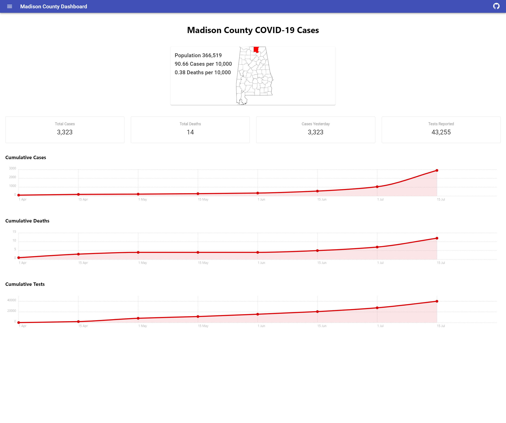
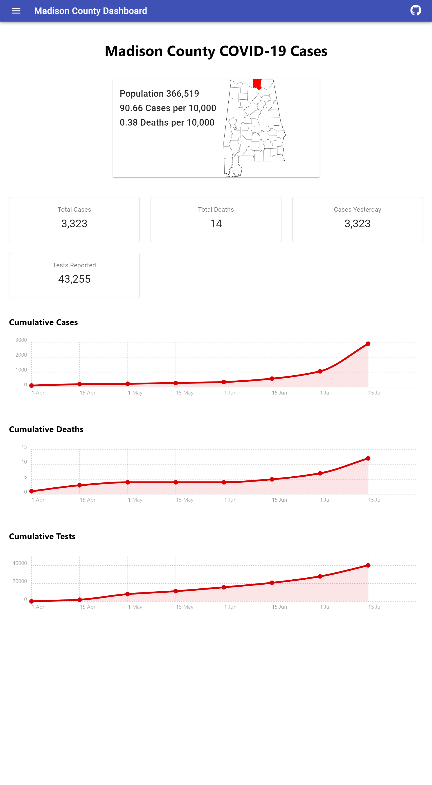
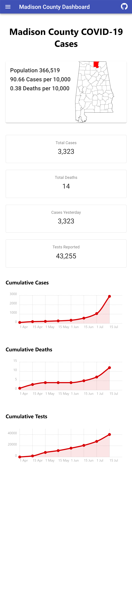

# Madison County Dashboard with React

# Technologies used
  - React.js
  - Node
  - HTML
  - CSS
  
# External Api used
  - https://bamatracker.com/api

  
# Process to run the code
  1. Make sure that you have the latest version of Node.js and npm installed.
  2. Move to the appropriate directory: cd <covid19madison-alabama>.
  3. Install the covid19madison-alabama app dependencies. 
  4. Run "npm install" to install dependencies.
  5. After the dependencies are installed run "npm start".
  6. The application will run on local "http://localhost:3000".

# Features in the Application 
  1. This applications loads Madison County Dashboard.
  
## Web view in desktop

## Web view in ipad

## Web view in mobile
